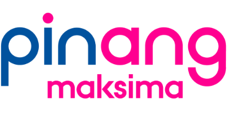
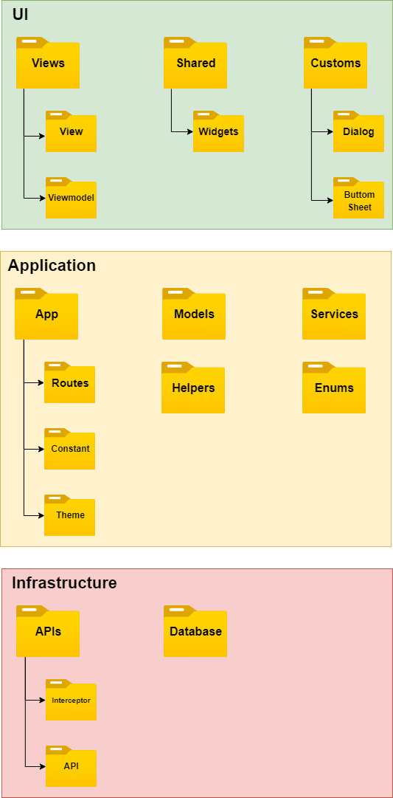

# Pinang Maksima Web

Pinang Maksima Web Apps

<br/>



<br/>

> For AO (Account Officer) who needs to assess and track what type of loan is being done in the branch area, the Pinang Maksima web app is a credit scoring app, that creates, tracks, and monitors loans. Unlike the current manual system, our product can get scoring results faster and can be accessed any time from anywhere.

## Architecture

We are using [Stacked Architecture](https://www.filledstacks.com/post/flutter-and-provider-architecture-using-stacked) which was an implementation of MVVM.



## Flutter Channel

Flutter has four [release channels](https://github.com/flutter/flutter/wiki/Flutter-build-release-channels): stable, beta, dev, and master. We decide using the stable channel for production app releases.

## Flutter Documentation

For help with Flutter, view [online documentation](https://flutter.dev/docs), which offers tutorials, samples, guidance, and a full API reference.

## VS Code Extensions

### Necessary

- [Flutter](https://marketplace.visualstudio.com/items?itemName=Dart-Code.flutter)
- [Dart](https://marketplace.visualstudio.com/items?itemName=Dart-Code.dart-code)

### Optional

- [Prettier](https://marketplace.visualstudio.com/items?itemName=esbenp.prettier-vscode)
- [Material Icon Theme](https://marketplace.visualstudio.com/items?itemName=PKief.material-icon-theme)
- [Git Graph](https://marketplace.visualstudio.com/items?itemName=mhutchie.git-graph)
- [Todo Tree](https://marketplace.visualstudio.com/items?itemName=Gruntfuggly.todo-tree)
- [Dart Import](https://marketplace.visualstudio.com/items?itemName=luanpotter.dart-import)
- [Dart Data Class Generator](https://marketplace.visualstudio.com/items?itemName=BendixMa.dart-data-class-generator)
- [Pubspec Assist](https://marketplace.visualstudio.com/items?itemName=jeroen-meijer.pubspec-assist)
- [Version Lens](https://marketplace.visualstudio.com/items?itemName=pflannery.vscode-versionlens)
- [Bracket Pair Colorizer](https://marketplace.visualstudio.com/items?itemName=CoenraadS.bracket-pair-colorizer)
- [Better Comments](https://marketplace.visualstudio.com/items?itemName=aaron-bond.better-comments)
- [Awesome Flutter Snippets](https://marketplace.visualstudio.com/items?itemName=Nash.awesome-flutter-snippets)

## Running The App

```
$ flutter pub get
$ flutter run --flavor <flavorName> -t lib/main_<flavorName>.dart

e.g.
$ flutter run --flavor dev -t lib/main_dev.dart
```

## Run Tests in a Terminal

You can use a terminal to run the tests by executing the following command from the root of the project:

```
$ flutter test
```

## Run Tests Using VSCode

The Flutter plugins for VSCode support running tests. This is often the best option while writing tests because it provides the fastest feedback loop as well as the ability to set breakpoints.

1. Select the Debug menu
2. Click the Start Debugging option

## About Using Dart Code Generator

Doing more with less is key to progress. No one likes repeating the same task over and over again. It is tedious, boring, and not creative at all. Humans are really bad at this. We often make mistakes when doing something repetitive.

As programmers, we don’t like to write boilerplate code or duplicate code, it’s frustrating and boring. With the same capabilities by using Code Generator, we can avoid error prone, time consuming code, and improve scalability.

To generate the code, both package run the same command:

```
$ flutter pub run build_runner build --delete-conflicting-outputs
```

## Flutter for Apple M1 Users

Inside your _iOS Folder_ follow these commands in terminal:

```
$ sudo arch -x86_64 gem install ffi
$ arch -x86_64 pod install
```

If doesn't work try this:

```
$ arch -x86_64 pod install --repo-update
```
